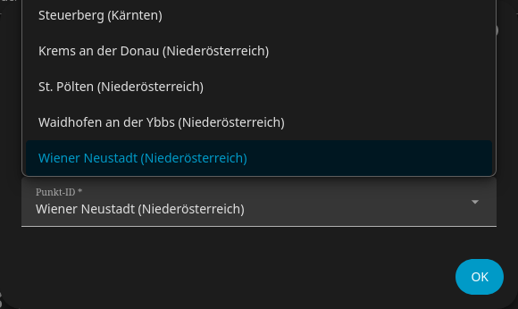
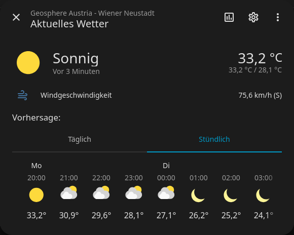
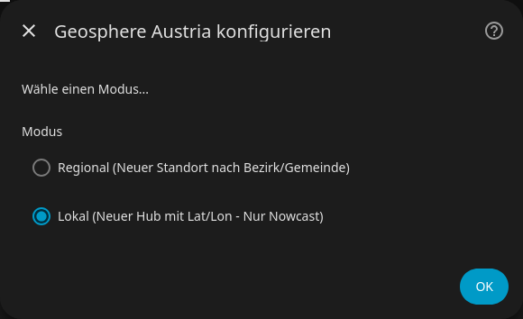
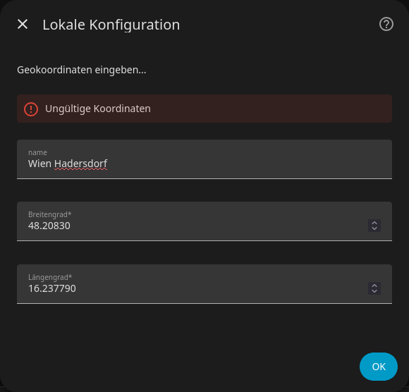
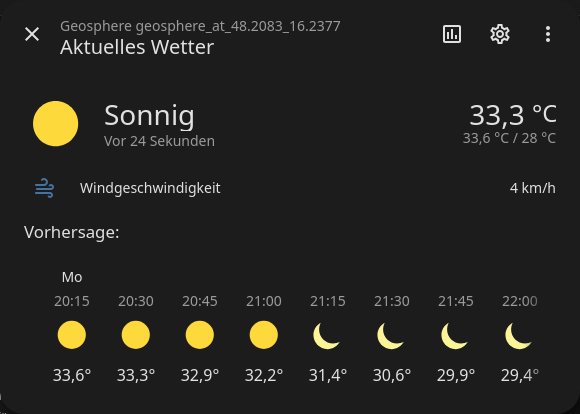
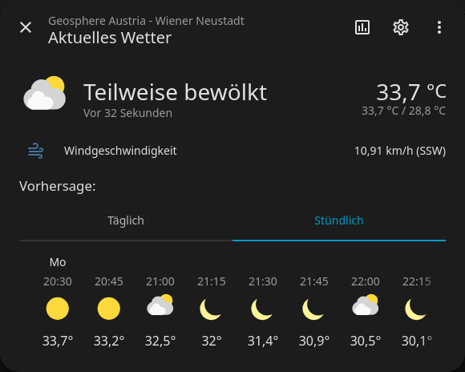

# Geosphere Austria Home Assistant Integration

*Eine HACS Integration für Home Assistant zur Anzeige von Wetterdaten von GeoSphere Austria.*

[](https://github.com/juri-w/hass-geosphere-at/releases)
[](LICENSE)

## Inhaltsverzeichnis

- [Installation](#installation)
- [Erste Einrichtung](#erste-einrichtung)
- [Modi erklärt](#modi-erklärt)
- [Hybrid-Funktion](#hybrid-funktion)
- [Konfigurationsoptionen](#konfigurationsoptionen)
- [Troubleshooting](#troubleshooting)
- [Entwicklung & Testing](#entwicklung--testing)
- [Support & Beitrag](#support--beitrag)
- [Lizenz](#lizenz)
- [Danksagung](#danksagung)

## Installation

### Option A: Über HACS (Empfohlen)

1. Öffne Home Assistant und gehe zu **Einstellungen → Add-ons & Marketplace**
2. Tippe auf die drei Punkte oben rechts → **Repository hinzufügen**
3. Gib folgenden Link ein: `https://github.com/juri-w/hass-geosphere-at`
   - Kategorie: **Integration**
   - Klick auf **Hinzufügen**
4. Suche nach **"Geosphere Austria"** im Marketplace und klicke auf **Installieren**
5. Starte Home Assistant neu (**Einstellungen → System → Neustart**)
6. Gehe zu **Einstellungen → Geräte & Dienste → Integrationen**
7. Klicke unten rechts auf **+ Integration hinzufügen**
8. Suche nach **"Geosphere Austria"** und wähle es aus
   <!-- ![Screenshot: Neue Integration hinzufügen] -->

---

### Option B: Manuelles Installieren

1. Erstelle folgenden Ordner: `config/custom_components/geosphere_at/`
2. Kopiere alle Dateien aus `/custom_components/` dorthin
3. Starte Home Assistant neu
4. Füge die Integration wie [oben beschrieben](#installation) hinzu

## Erste Einrichtung

### Regionaler Forecast (Bezirk/Gemeinde)

1. Wähle beim Setup **"Regional (Vorhersage nach Bezirk/Gemeinde)"**

   
2. Warte kurz, bis die Liste der Standorte lädt
3. Wähle deinen Standort aus der Dropdown-Liste

   
4. Klicke auf **Absenden**
5. Fertig! Dein Wetter-Sensor ist aktiv

   
   

---

### Lokaler Forecast (exakte Koordinaten)

Nutze diesen Modus, wenn du präzise GPS-Koordinaten verwenden möchtest:

1. Wähle beim Setup **"Lokal (Neuer Hub mit Lat/Lon)"**

   
2. Gib deine Breiten- und Längengrade ein (z.B. via OpenStreetMap)

   
3. Optional: Benenne den Sensor (z.B. **"Garten"**)
4. Klicke auf **Absenden**

   
  

> **Hinweis:** Der lokale Modus nutzt nur Nowcast-Daten (15-min Intervalle), bietet keine tägliche Vorhersage.

## Modi erklärt

| Modus      | Datenquelle         | Update-Intervall | Tägliche Vorhersage | Genauigkeit         |
|------------|---------------------|------------------|---------------------|---------------------|
| Regional   | GeoSphere Flexi API | 15 Minuten       | ✅ Ja (8 Tage)      | ⭐⭐⭐⭐⭐ Bezirksgenau |
| Lokal      | Nowcast API         | 15 Minuten       | ❌ Nein             | ⭐⭐⭐⭐⭐ Punktgenau  |
| Hybrid     | Both (Combined)     | 15 Minuten       | ✅ Ja               | ⭐⭐⭐⭐⭐⭐ Beste Kombination |

**Was ist der Unterschied?**
- **Regional:** Verwendet administrative Grenzen (Bezirke/Gemeinden)
- **Lokal:** Verwendet exakte GPS-Koordinaten für noch präzisere lokale Werte

## Hybrid-Funktion

Der Hybrid-Modus kombiniert die besten Eigenschaften beider Datenquellen:

| Feature          | Beschreibung                          |
|------------------|---------------------------------------|
| Wetter-Symbol    | Von Regional (bessere Langzeitprognose)|
| Temperatur       | Von Nowcast (höhere Aktualität)       |
| Wind             | Von Hybrid-Berechnung                 |
| Tagesvorhersage  | Von Regional (bis 8 Tage)             |

### Hybrid konfigurieren

1. Nach Erstellung eines regionalen Eintrags:
   - Gehe zu **Einstellungen → Geräte & Dienste**
   - Klicke auf deinen **Geosphere Austria** Eintrag
   - Wähle **Konfigurieren** (Zahnrad-Symbol)

   
2. Aktiviere **"Nowcast aktivieren"**
3. Gib genauer Koordinaten ein (optional, Standard = Standort des regionalen Sensors)
4. Speichere die Änderungen

   

---

### Daten-Refresh-Intervall

Standardmäßig aktualisiert sich die Integration alle **15 Minuten**.

---

### Verfügbare Entitäten

Nach der Einrichtung stehen folgende Entitäten zur Verfügung:


Verfügbare Entitäten


| Entität                     | Beschreibung            | Einheit |
|-----------------------------|--------------------------|---------|
| `weather.geosphere_at_*`    | Wetter-Sensor            | °C      |
| `sensor.temperature`        | Aktuelle Temperatur      | °C      |
| `sensor.wind_speed`         | Windgeschwindigkeit      | km/h    |
| `sensor.wind_gust`          | Windböen                 | km/h    |
| `sensor.wind_bearing`       | Windrichtung             | Grad    |
| `sensor.precipitation`      | Niederschlag             | mm      |

> **Tipp:** Nutze diese Entitäten in Dashboards und Automatisierungen!
> <!-- ![Screenshot: Dashboard mit Wetter-Karten] -->

---

## Troubleshooting


Häufige Probleme


| Problem                          | Ursache                          | Lösung                                                                 |
|----------------------------------|----------------------------------|------------------------------------------------------------------------|
| "Nicht verfügbar" Status         | Home Assistant neu gestartet     | Warte 2-3 Minuten oder lade die Integration neu                      |
|                                  | API-Antwort fehlgeschlagen        | Prüfe HA-Logs (**Einstellungen → System → Logs**)                     |
|                                  | Korrupter Eintrag                 | Lösche und füge die Integration neu hinzu                              |
| Keine 15-min Vorhersagepunkte    | Home Assistant standard Weather Widget gruppiert Daten oft stündlich | Custom Weather Card installieren (über HACS) oder eigenen Sensor erstellen |

### Problem: Falsche Temperaturwerte

- Stelle sicher, dass der korrekte **Modus** ausgewählt ist
- Prüfe im Log: **Einstellungen → Systeme → Logs → Geosphere Austria**
- Bei Hybrid: Koordinaten auf Richtigkeit überprüfen

### Logs anzeigen

Für Debugging-Informationen:

1. Gehe zu **Einstellungen → Systeme**
2. Klicke auf **Protokolle**
3. Filtere nach **"Geosphere"**

---

## Entwicklung & Testing

Für Entwickler, die an der Integration arbeiten möchten:

```bash
# Development environment
git clone https://github.com/juri-w/hass-geosphere-at.git
cd hass-geosphere-at
# Test in separater branch vor dem Merge
git checkout -b feature/new-feature
```

---

## Support & Beitrag

- **Fehler melden:** [GitHub Issues](https://github.com/juri-w/hass-geosphere-at/issues)
- **Feature Vorschläge:** [GitHub Discussions](https://github.com/juri-w/hass-geosphere-at/discussions)
- **Code Beitrag:** [Pull Requests willkommen](https://github.com/juri-w/hass-geosphere-at/pulls)


## Danksagung

- [GeoSphere Austria](https://www.geosphere.at) für die Wetterdaten
- [Home Assistant](https://home-assistant.io) Community
- [HACS](https://hacs.xyz) Team